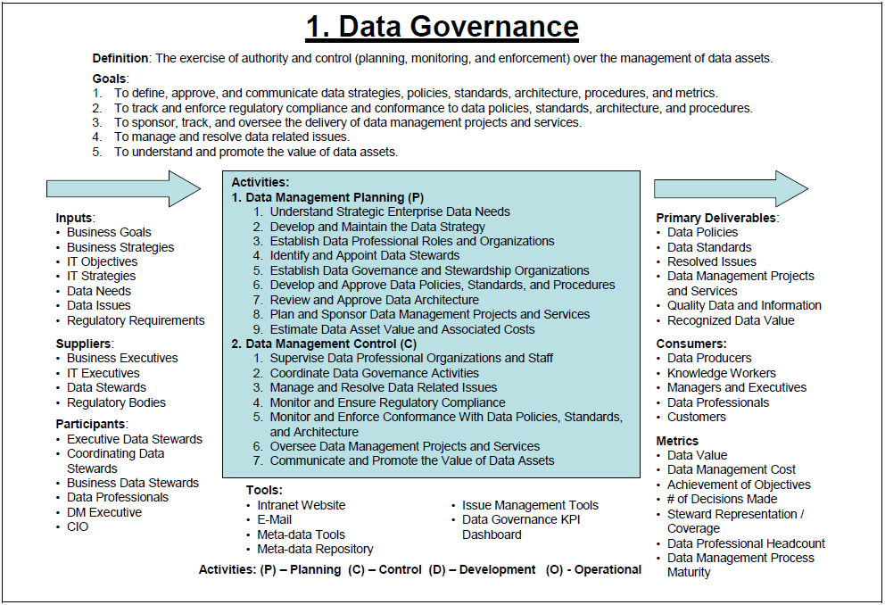

## What are Design Cards?

**Design Cards are One Placard of Information that discusses about Activities it needs to do. The interfaces the subject-area or the domain deals with. For example, Data Architecture Management may have about 2-3 activities and Data Development may have about 4 activities for our Concerned Project.**

**Such Design Cards include ML Pipelines, Training Loops, AI Approach**

### 1. Data Governance

- **The Data Value** on **Annotation** depends on: Sensitivity and Specificity
- **The Data Management** Cost on **Annotation** depends on: Steward Representation / Coverage
- **The Achievement of Objectives** on **Annotation** depends on: Net Promoter Score
- **The # Of Decisions Made** on **Annotation** depends on: Level of Automation

- **The Data Value** on **Availability** depends on: KPIs for Productivity

- **The Data Value** on **Provenance** depends on: Data Bias
- **The Data Management Cost** on **Provenance** depends on: Data Formats

While annotating data, the mistakes and unidentified objects in images, let's say are taken into consideration with True Positive Rate and False Positive Rate. This is termed as Specificity and Sensitivity. 

Annotation will cover the entire dataset and is distributed among people and data models that manually arrive at the answers. This incurs a cost to the management aspect as the tools that produce that amount of productivity is managed for automation as well as the headcount for annotating tasks and job management is an additional cost incurred to businesses. 

While annotating, the net promoter score is used to achieve the objectives of producing valid answers to the given questions. For example, if the data annotation task has about 3 questions and 1 is neutral, the decider on how the question has been perceived on a sentiment analysis problem is a valid objective. 

In the Availability scale, the tools used to obtain the dataset from given format to required format for annotation is a matter of Productivity and hence KPIs come into the problem solving context. 

Data Bias is a key factor of historical provenance and origins of the data because that is how the trained model will produce its output. 

The Cost on Provenance is dependent on the formats of data that are used. 

